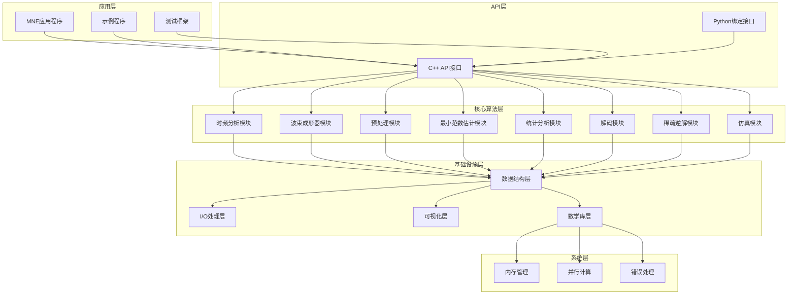
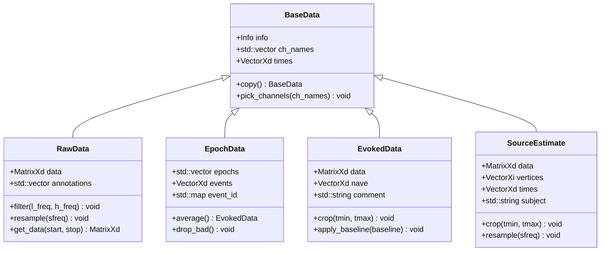

# MNE Python到C++核心算法移植设计文档

## 概述

本设计文档描述了将MNE Python版本的核心算法功能移植到MNE C++版本的技术架构和实现方案。设计目标是在保持与Python版本功能等价的同时，充分利用C++的性能优势和类型安全特性。

## 架构设计

### 整体架构



### 模块化设计原则

1. **单一职责原则**: 每个模块专注于特定的算法领域
2. **接口隔离**: 提供清晰的API接口，隐藏实现细节
3. **依赖倒置**: 高层模块不依赖低层模块，都依赖抽象
4. **开闭原则**: 对扩展开放，对修改封闭

## 组件和接口

### 核心数据结构

#### 基础数据类型
```cpp
namespace MNELIB {
    // 基础矩阵类型
    using MatrixXd = Eigen::MatrixXd;
    using VectorXd = Eigen::VectorXd;
    using MatrixXcd = Eigen::MatrixXcd;
    using VectorXcd = Eigen::VectorXcd;
    
    // 时间序列数据结构
    class TimeSeriesData {
    public:
        MatrixXd data;           // 数据矩阵 (n_channels x n_times)
        VectorXd times;          // 时间向量
        double sfreq;            // 采样频率
        std::vector<std::string> ch_names;  // 通道名称
    };
    
    // 频域数据结构
    class FrequencyData {
    public:
        MatrixXcd data;          // 复数数据矩阵
        VectorXd freqs;          // 频率向量
        VectorXd times;          // 时间向量
        double sfreq;            // 采样频率
    };
}
```

#### 信息结构
```cpp
namespace MNELIB {
    class Info {
    public:
        double sfreq;                           // 采样频率
        std::vector<ChannelInfo> chs;          // 通道信息
        std::vector<Projection> projs;         // 投影子
        CoordinateTransform dev_head_t;        // 坐标变换
        std::map<std::string, std::any> custom_ref_applied;
        
        // 方法
        void pick_channels(const std::vector<std::string>& ch_names);
        Info copy() const;
        bool operator==(const Info& other) const;
    };
}
```

### 时频分析模块

#### TFR计算引擎
```cpp
namespace TFRLIB {
    class TFRCompute {
    public:
        // Morlet小波变换
        static std::vector<MatrixXcd> tfr_morlet(
            const MatrixXd& data,
            double sfreq,
            const VectorXd& freqs,
            double n_cycles = 7.0,
            bool use_fft = true,
            int decim = 1,
            bool output = "power"
        );
        
        // 多锥度方法
        static std::vector<MatrixXd> tfr_multitaper(
            const MatrixXd& data,
            double sfreq,
            const VectorXd& freqs,
            int n_cycles = 7,
            double time_bandwidth = 4.0,
            bool use_fft = true,
            int decim = 1
        );
        
        // Stockwell变换
        static std::vector<MatrixXcd> tfr_stockwell(
            const MatrixXd& data,
            double sfreq,
            const VectorXd& freqs,
            int width = 1.0,
            int decim = 1
        );
    };
    
    // 交叉谱密度计算
    class CSDCompute {
    public:
        static MatrixXcd csd_fourier(
            const std::vector<MatrixXd>& epochs_data,
            double sfreq,
            double fmin,
            double fmax,
            int n_fft = 256
        );
        
        static MatrixXcd csd_morlet(
            const std::vector<MatrixXd>& epochs_data,
            double sfreq,
            const VectorXd& freqs,
            double n_cycles = 7.0,
            bool use_fft = true
        );
        
        static MatrixXcd csd_multitaper(
            const std::vector<MatrixXd>& epochs_data,
            double sfreq,
            double fmin,
            double fmax,
            double time_bandwidth = 4.0,
            bool adaptive = false
        );
    };
}
```

### 波束成形器模块

#### LCMV波束成形器
```cpp
namespace BEAMFORMERLIB {
    class LCMVBeamformer {
    public:
        struct Parameters {
            double reg = 0.05;
            std::string weight_norm = "unit-noise-gain-invariant";
            std::string pick_ori = "max-power";
            bool reduce_rank = false;
            std::optional<double> depth = std::nullopt;
            std::string inversion = "matrix";
        };
        
        // 创建LCMV滤波器
        static Beamformer make_lcmv(
            const Info& info,
            const ForwardSolution& forward,
            const CovarianceMatrix& data_cov,
            const Parameters& params = Parameters{}
        );
        
        // 应用LCMV滤波器
        static SourceEstimate apply_lcmv(
            const EvokedData& evoked,
            const Beamformer& beamformer
        );
        
        static std::vector<SourceEstimate> apply_lcmv_epochs(
            const std::vector<EpochData>& epochs,
            const Beamformer& beamformer
        );
    };
    
    // DICS波束成形器
    class DICSBeamformer {
    public:
        struct Parameters {
            double reg = 0.05;
            std::string weight_norm = "unit-noise-gain-invariant";
            std::string pick_ori = "max-power";
            bool reduce_rank = false;
            bool real_filter = false;
        };
        
        static Beamformer make_dics(
            const Info& info,
            const ForwardSolution& forward,
            const CrossSpectralDensity& csd,
            const Parameters& params = Parameters{}
        );
        
        static SourceEstimate apply_dics(
            const EvokedData& evoked,
            const Beamformer& beamformer
        );
    };
}
```

### 预处理模块

#### ICA实现
```cpp
namespace PREPROCESSINGLIB {
    class ICA {
    public:
        enum class Method {
            FASTICA,
            INFOMAX,
            PICARD
        };
        
        struct Parameters {
            int n_components = 0;
            Method method = Method::FASTICA;
            std::string fun = "logcosh";
            double fun_args = 1.0;
            int max_iter = 200;
            double tol = 1e-4;
            int random_state = 0;
        };
        
        ICA(const Parameters& params = Parameters{});
        
        // 拟合ICA模型
        void fit(const MatrixXd& data);
        
        // 应用ICA清理
        MatrixXd apply(const MatrixXd& data, 
                      const std::vector<int>& exclude = {}) const;
        
        // 获取源信号
        MatrixXd get_sources(const MatrixXd& data) const;
        
        // 获取混合矩阵和解混矩阵
        MatrixXd get_mixing_matrix() const { return mixing_matrix_; }
        MatrixXd get_unmixing_matrix() const { return unmixing_matrix_; }
        
    private:
        Parameters params_;
        MatrixXd mixing_matrix_;
        MatrixXd unmixing_matrix_;
        std::vector<int> exclude_;
        bool fitted_ = false;
    };
    
    // Maxwell滤波
    class MaxwellFilter {
    public:
        struct Parameters {
            std::string origin = "auto";
            int int_order = 8;
            int ext_order = 3;
            double calibration = 1.0;
            double cross_talk = 0.9;
            std::string st_correlation = 0.98;
            double st_duration = 10.0;
        };
        
        static RawData maxwell_filter(
            const RawData& raw,
            const Parameters& params = Parameters{}
        );
        
        static MatrixXd compute_maxwell_basis(
            const Info& info,
            const std::string& origin,
            int int_order,
            int ext_order
        );
    };
}
```

### 最小范数估计模块

#### 逆算子和应用
```cpp
namespace MINIMUMNORMLIB {
    class InverseOperator {
    public:
        struct Parameters {
            std::string method = "dSPM";
            double lambda2 = 1.0 / 9.0;
            std::string pick_ori = "auto";
            bool normalize = true;
            std::optional<double> depth = std::nullopt;
            bool fixed = false;
            bool loose = 0.2;
            std::string rank = "info";
        };
        
        // 创建逆算子
        static InverseOperator make_inverse_operator(
            const Info& info,
            const ForwardSolution& forward,
            const CovarianceMatrix& noise_cov,
            const Parameters& params = Parameters{}
        );
        
        // 应用逆解
        static SourceEstimate apply_inverse(
            const EvokedData& evoked,
            const InverseOperator& inverse,
            double lambda2,
            const std::string& method = "dSPM"
        );
        
        static std::vector<SourceEstimate> apply_inverse_epochs(
            const std::vector<EpochData>& epochs,
            const InverseOperator& inverse,
            double lambda2,
            const std::string& method = "dSPM"
        );
        
        // 计算源功率谱
        static SpectrumArray compute_source_psd(
            const RawData& raw,
            const InverseOperator& inverse,
            double lambda2,
            const std::string& method = "dSPM",
            double fmin = 0,
            double fmax = 200,
            int n_fft = 2048
        );
        
    private:
        MatrixXd gain_matrix_;
        SourceSpace source_space_;
        std::string method_;
        bool is_prepared_ = false;
    };
}
```

### 统计分析模块

#### 聚类置换检验
```cpp
namespace STATSLIB {
    class ClusterPermutation {
    public:
        struct Parameters {
            int n_permutations = 1024;
            double threshold = 1.67;
            int tail = 0;
            std::string stat_fun = "ttest_1samp_no_p";
            MatrixXi adjacency;
            int n_jobs = 1;
            int seed = 0;
        };
        
        struct Result {
            VectorXd T_obs;                    // 观察到的统计量
            std::vector<VectorXi> clusters;    // 聚类
            VectorXd cluster_p_values;         // 聚类p值
            VectorXd H0;                       // 零假设分布
        };
        
        // 单样本聚类置换检验
        static Result permutation_cluster_1samp_test(
            const std::vector<MatrixXd>& X,
            const Parameters& params = Parameters{}
        );
        
        // 双样本聚类置换检验
        static Result permutation_cluster_test(
            const std::vector<MatrixXd>& X,
            const std::vector<MatrixXd>& Y,
            const Parameters& params = Parameters{}
        );
        
        // 时空聚类检验
        static Result spatio_temporal_cluster_test(
            const std::vector<MatrixXd>& X,
            const std::vector<MatrixXd>& Y,
            const MatrixXi& adjacency,
            const Parameters& params = Parameters{}
        );
    };
    
    // 多重比较校正
    class MultipleComparison {
    public:
        // FDR校正
        static std::pair<VectorXb, VectorXd> fdr_correction(
            const VectorXd& pvals,
            double alpha = 0.05,
            const std::string& method = "indep"
        );
        
        // Bonferroni校正
        static std::pair<VectorXb, VectorXd> bonferroni_correction(
            const VectorXd& pvals,
            double alpha = 0.05
        );
    };
}
```

## 数据模型

### 核心数据类型层次结构



### 算法接口设计

```cpp
namespace MNELIB {
    // 算法基类接口
    template<typename InputType, typename OutputType>
    class Algorithm {
    public:
        virtual ~Algorithm() = default;
        virtual OutputType compute(const InputType& input) = 0;
        virtual void set_parameters(const std::map<std::string, std::any>& params) = 0;
        virtual std::map<std::string, std::any> get_parameters() const = 0;
    };
    
    // 可配置算法接口
    template<typename ParamType>
    class ConfigurableAlgorithm {
    public:
        virtual ~ConfigurableAlgorithm() = default;
        virtual void configure(const ParamType& params) = 0;
        virtual ParamType get_configuration() const = 0;
        virtual bool is_configured() const = 0;
    };
    
    // 可训练算法接口
    template<typename DataType>
    class TrainableAlgorithm {
    public:
        virtual ~TrainableAlgorithm() = default;
        virtual void fit(const DataType& training_data) = 0;
        virtual bool is_fitted() const = 0;
        virtual void reset() = 0;
    };
}
```

## 错误处理

### 异常层次结构

```cpp
namespace MNELIB {
    class MNEException : public std::exception {
    public:
        explicit MNEException(const std::string& message) : message_(message) {}
        const char* what() const noexcept override { return message_.c_str(); }
        
    private:
        std::string message_;
    };
    
    class DataException : public MNEException {
    public:
        explicit DataException(const std::string& message) 
            : MNEException("Data Error: " + message) {}
    };
    
    class AlgorithmException : public MNEException {
    public:
        explicit AlgorithmException(const std::string& message)
            : MNEException("Algorithm Error: " + message) {}
    };
    
    class IOException : public MNEException {
    public:
        explicit IOException(const std::string& message)
            : MNEException("IO Error: " + message) {}
    };
    
    class ConfigurationException : public MNEException {
    public:
        explicit ConfigurationException(const std::string& message)
            : MNEException("Configuration Error: " + message) {}
    };
}
```

### 错误处理策略

1. **输入验证**: 所有公共API都进行严格的输入验证
2. **资源管理**: 使用RAII原则管理内存和文件资源
3. **异常安全**: 提供强异常安全保证
4. **错误传播**: 使用异常机制传播错误信息
5. **日志记录**: 记录详细的错误信息用于调试

## 正确性属性

*属性是一个特征或行为，应该在系统的所有有效执行中保持为真——本质上是关于系统应该做什么的正式陈述。属性作为人类可读规范和机器可验证正确性保证之间的桥梁。*

基于需求分析，以下是核心算法模块必须满足的正确性属性：

### 属性1: 时频变换能量守恒
*对于任何* 有限能量信号，时频变换（Morlet、multitaper、Stockwell）的总能量应该与原始信号的能量成正比
**验证: 需求 1.1, 1.2, 1.3**

### 属性2: 交叉谱密度厄米特性
*对于任何* 两个实值信号的交叉谱密度矩阵，应该满足厄米特性质：CSD(f1,f2) = CSD*(f2,f1)
**验证: 需求 1.4**

### 属性3: 功率谱密度非负性
*对于任何* 实值信号，功率谱密度在所有频率上都应该是非负的
**验证: 需求 1.5**

### 属性4: LCMV约束满足
*对于任何* LCMV波束成形器，空间滤波器应该满足线性约束条件：W^T * G = I，其中W是滤波器，G是导联场矩阵
**验证: 需求 2.1**

### 属性5: 波束成形器数据类型一致性
*对于任何* 波束成形器和相同的源活动，应用于不同数据类型（raw、epochs、evoked）应该产生一致的源估计结果
**验证: 需求 2.2, 2.3**

### 属性6: ICA解混可逆性
*对于任何* 拟合的ICA模型，混合矩阵和解混矩阵应该互为逆矩阵：W * A ≈ I
**验证: 需求 3.1**

### 属性7: Maxwell滤波球谐基正交性
*对于任何* Maxwell滤波器的球谐函数基，不同阶数和度数的基函数应该满足正交性条件
**验证: 需求 3.3**

### 属性8: 逆算子线性性
*对于任何* 逆算子和线性组合的输入数据，输出的源估计应该等于各输入源估计的相同线性组合
**验证: 需求 4.2**

### 属性9: 置换检验分布性质
*对于任何* 置换检验，零假设下的置换分布应该以真实统计量为中心，且具有预期的统计性质
**验证: 需求 5.1**

### 属性10: 多重比较校正单调性
*对于任何* 多重比较校正方法，校正后的p值应该保持原始p值的单调性顺序
**验证: 需求 5.2**

### 属性11: CSP方差比最大化
*对于任何* CSP滤波器，应该最大化两个条件间的方差比，即满足广义特征值问题的解
**验证: 需求 6.1**

### 属性12: 稀疏重建稀疏性约束
*对于任何* 稀疏逆解算法，解的稀疏性应该随正则化参数的增加而增加
**验证: 需求 7.1**

### 属性13: 仿真数据统计一致性
*对于任何* 仿真参数设置，生成的仿真数据应该具有与参数一致的统计性质（均值、方差、频谱等）
**验证: 需求 8.1**

### 属性14: 正向解线性叠加
*对于任何* 正向解和多个偶极子源，总的正向解应该等于各个偶极子正向解的线性叠加
**验证: 需求 9.1**

### 属性15: 数据格式往返一致性
*对于任何* 支持的数据格式，保存然后加载数据应该产生与原始数据数值等价的结果
**验证: 需求 10.1, 15.1**

### 属性16: 蒙太奇坐标变换保距性
*对于任何* 蒙太奇坐标变换，电极间的相对距离应该在变换前后保持不变
**验证: 需求 11.1**

### 属性17: 连接性度量对称性
*对于任何* 对称连接性度量（如相干性），连接矩阵应该满足对称性：C(i,j) = C(j,i)
**验证: 需求 13.1**

### 属性18: FIR滤波器线性相位
*对于任何* FIR滤波器，相位响应应该在通带内保持线性关系
**验证: 需求 14.1**

## 错误处理

### 异常层次结构

```cpp
namespace MNELIB {
    class MNEException : public std::exception {
    public:
        explicit MNEException(const std::string& message) : message_(message) {}
        const char* what() const noexcept override { return message_.c_str(); }
        
    private:
        std::string message_;
    };
    
    class DataException : public MNEException {
    public:
        explicit DataException(const std::string& message) 
            : MNEException("Data Error: " + message) {}
    };
    
    class AlgorithmException : public MNEException {
    public:
        explicit AlgorithmException(const std::string& message)
            : MNEException("Algorithm Error: " + message) {}
    };
    
    class IOException : public MNEException {
    public:
        explicit IOException(const std::string& message)
            : MNEException("IO Error: " + message) {}
    };
    
    class ConfigurationException : public MNEException {
    public:
        explicit ConfigurationException(const std::string& message)
            : MNEException("Configuration Error: " + message) {}
    };
}
```

### 错误处理策略

1. **输入验证**: 所有公共API都进行严格的输入验证
2. **资源管理**: 使用RAII原则管理内存和文件资源
3. **异常安全**: 提供强异常安全保证
4. **错误传播**: 使用异常机制传播错误信息
5. **日志记录**: 记录详细的错误信息用于调试

## 测试策略

### 双重测试方法

本项目采用单元测试和基于属性的测试相结合的方法：

#### 单元测试
- 验证特定示例和边界情况
- 测试错误条件和异常处理
- 验证与Python版本的数值等价性
- 集成测试验证组件间交互

#### 基于属性的测试
- 验证算法的通用属性
- 使用随机生成的输入进行大规模测试
- 每个属性测试运行最少100次迭代
- 测试标签格式: **Feature: mne-python-to-cpp-migration, Property {number}: {property_text}**

### 测试框架配置

使用Google Test作为主要测试框架，配合Hypothesis-style属性测试库：

```cpp
// 示例属性测试结构
class TFRPropertyTest : public ::testing::Test {
protected:
    void SetUp() override {
        // 设置测试环境
    }
    
    // 属性测试辅助函数
    MatrixXd generate_random_signal(int n_channels, int n_times, double sfreq);
    VectorXd generate_frequency_vector(double fmin, double fmax, int n_freqs);
};

TEST_F(TFRPropertyTest, MorletRoundTripProperty) {
    // Feature: mne-python-to-cpp-migration, Property 1: 时频变换能量守恒
    for (int i = 0; i < 100; ++i) {
        // 生成随机输入并测试属性
    }
}
```