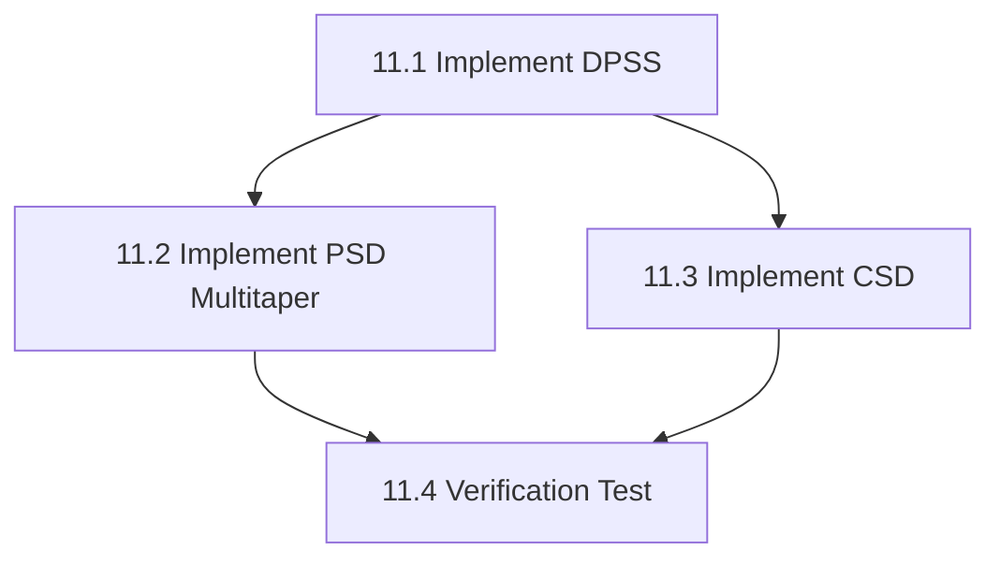

# Phase 11: Advanced Time-Frequency (Multitaper & CSD) - S3 Task

## 任务拆分

### Task 11.1: 实现 DPSS 窗函数
*   **目标**: 在 `TFRUtils` 中实现 `dpss_windows`。
*   **输入**: N, NW, Kmax。
*   **输出**: 窗函数矩阵。
*   **验证**: 验证正交性，与 Python `scipy.signal.windows.dpss` (如果可能) 或预计算值对比。

### Task 11.2: 实现 PSD Multitaper
*   **目标**: 在 `PSD` 类中实现 `psd_multitaper`。
*   **输入**: 矩阵数据。
*   **输出**: PSD 矩阵。
*   **依赖**: Task 11.1, Eigen FFT。

### Task 11.3: 实现 CSD 类及 Multitaper 计算
*   **目标**: 创建 `csd.h/cpp`，实现 `CSD` 类。
*   **输入**: Epochs。
*   **输出**: CSD 对象。
*   **依赖**: Task 11.1。

### Task 11.4: 验证测试
*   **目标**: 创建 `test_tfr_multitaper`。
*   **验证点**:
    *   DPSS 形状和正交性。
    *   PSD 在正弦波信号下的峰值位置。
    *   CSD 在相关信号下的非零互谱。

## 任务依赖图

