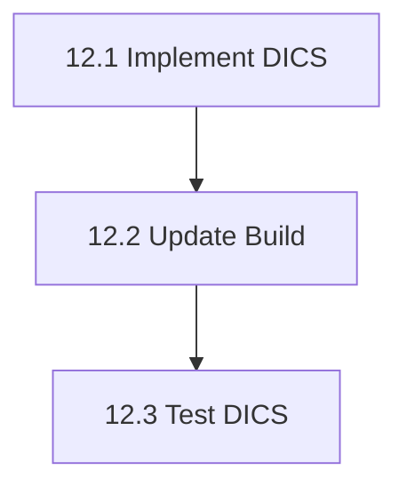

# Phase 12: Frequency-Domain Beamformer (DICS) - S3 Task

## 任务拆分

### Task 12.1: 实现 DICS 类
*   **目标**: 创建 `src/libraries/inverse/beamformer/dics.h` 和 `dics.cpp`。
*   **输入**: Leadfield, CSD.
*   **输出**: Source Power Matrix.
*   **实现细节**:
    *   矩阵求逆 (使用 `Eigen::LDLT` 或 `SelfAdjointEigenSolver` 以获得更好的稳定性)。
    *   正则化逻辑。
    *   OpenMP 并行化（如果可用，否则串行）。

### Task 12.2: 更新构建系统
*   **目标**: 修改 `src/libraries/inverse/CMakeLists.txt`。
*   **动作**: 添加 `dics.cpp`，链接 `mne_tfr`。

### Task 12.3: 验证测试
*   **目标**: 创建 `src/testframes/test_dics`。
*   **内容**:
    *   生成模拟数据：两个正弦源 (10Hz, 20Hz) 在不同位置。
    *   计算 CSD。
    *   构建 Leadfield (简化版，随机或简单的几何假设)。
    *   运行 DICS。
    *   验证 10Hz 处的功率峰值对应源 1 的位置，20Hz 对应源 2。

## 任务依赖图

