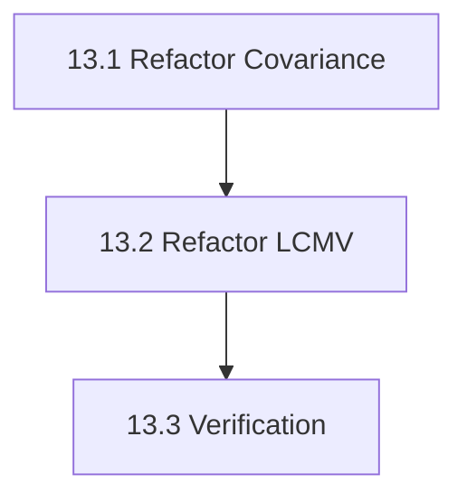

# Phase 13: Covariance & LCMV Refactoring - S3 Task

## 任务拆分

### Task 13.1: 重构 Covariance
*   **文件**: `covariance.h`, `covariance.cpp`
*   **内容**:
    *   定义 `Covariance` 类。
    *   实现 `compute_empirical` (vector of epochs)。
    *   实现简单的 `regularize`。

### Task 13.2: 重构 LCMV
*   **文件**: `lcmv.h`, `lcmv.cpp`
*   **内容**:
    *   定义 `BeamformerWeights` 结构。
    *   实现 `make_lcmv`，支持 max-power 和 unit-noise-gain。
    *   更新 `apply`。

### Task 13.3: 验证测试
*   **文件**: `src/testframes/test_lcmv_cov`
*   **内容**:
    *   测试 Covariance 计算正确性 (与 Numpy 对比，或已知分布)。
    *   测试 LCMV Max-Power (应指向源的主方向)。
    *   测试 UNG (权重范数应受控)。

## 任务依赖图

