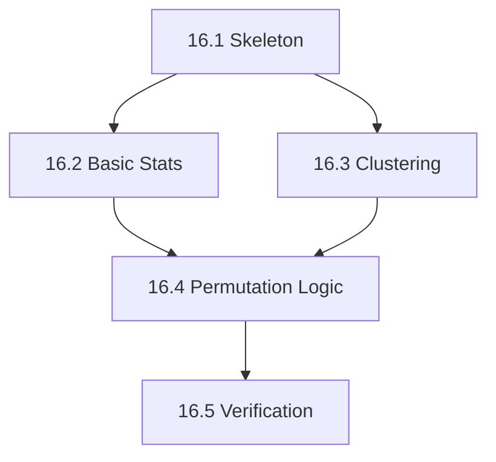

# Phase 16: Non-Parametric Statistics - S3 Task

## 任务拆分

### Task 16.1: 创建 Stats 库骨架
*   创建 `src/libraries/stats` 目录。
*   编写 `CMakeLists.txt`。
*   定义 `stats_global.h`。
*   更新项目根 `CMakeLists.txt` (如果需要) 或确保它可以被测试工程链接。

### Task 16.2: 实现基础统计功能
*   创建 `statistics.h/cpp`。
*   实现 `ttest1Samp` 和 `ttestIndep`。
*   使用 Eigen 进行向量化计算。

### Task 16.3: 实现聚类逻辑
*   创建 `clusterpermutation.h/cpp`。
*   实现 `findClusters`：
    *   支持基于 `Eigen::SparseMatrix` 的空间聚类。
    *   支持基于索引的 1D 时间聚类（当 adj 为空时）。

### Task 16.4: 实现置换检验流程
*   在 `clusterpermutation.cpp` 中实现 `permutationClusterOneSampleTest`。
*   集成 `QtConcurrent` 进行并行置换。
*   实现随机符号翻转逻辑。

### Task 16.5: 验证测试
*   创建 `src/testframes/test_stats`。
*   测试 1: 验证 `ttest` 结果与已知值（手算或简单逻辑）一致。
*   测试 2: 验证 1D 聚类（简单时间序列）。
*   测试 3: 验证 2D 聚类（模拟简单的空间邻接）。

## 任务依赖图

