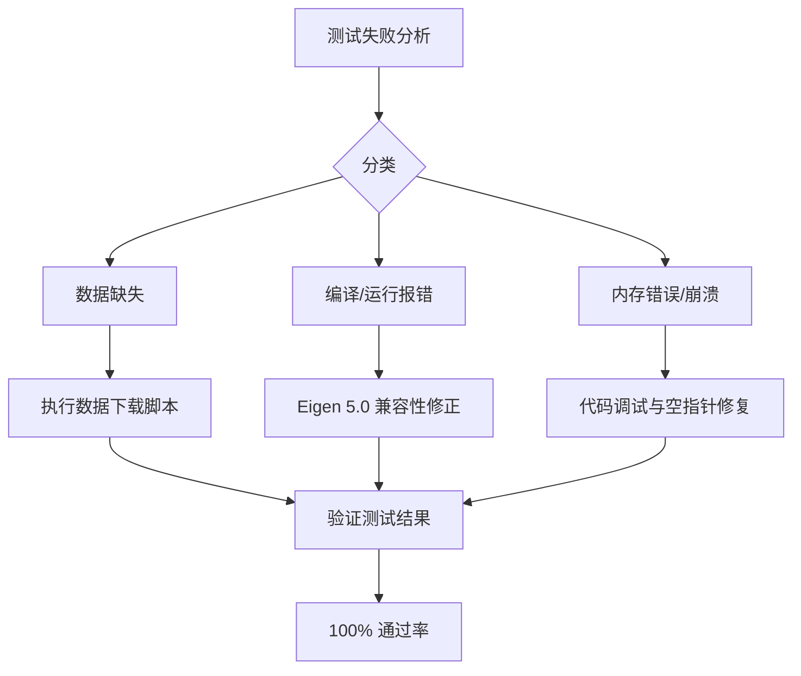

# S2-DESIGN (架构阶段)

## 1. 整体修复策略
由于测试失败涉及多种原因，我们将采取分层修复策略。

## 2. 核心组件修复逻辑
### 2.1 FiffStream & FiffCoordTrans
* **问题**: 在某些测试用例中，`FiffStream` 的 `streamName` 访问可能触发崩溃。
* **设计**: 
    * 增加防御性检查（Check for null pointers）。
    * 确保 `QFile` 或 `QIODevice` 在流关闭后不被非法访问。

### 2.2 Eigen 兼容层
* **问题**: Eigen 5.0 禁止在 2D Matrix 上使用 1D 线性索引。
* **设计**: 
    * 检查所有涉及 `MatrixXd`, `VectorXd` 的线性访问。
    * 推荐使用 `.data()[i]` (明确表示底层内存访问) 或 `(row, col)`。

## 3. 异常处理策略
* 在单元测试的 `initTestCase` 中增加对数据文件存在的硬性检查，提供清晰的报错信息。
* 使用 Qt 的 `QVERIFY` 和 `QCOMPARE` 替代简单的 `assert`，以保证测试套件的健壮性。
