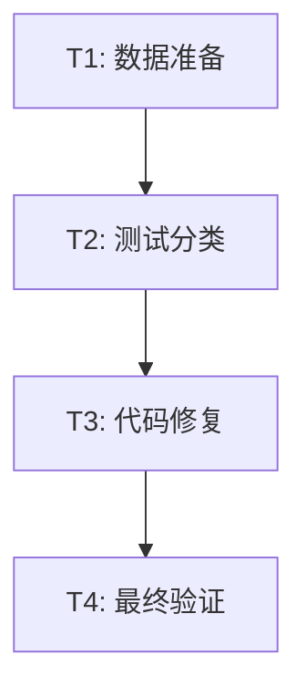

# S3-TASK (原子化阶段)

## 1. 子任务拆分

### T1: 测试数据环境补全
* **输入**: `tools/download_data.bat` 脚本。
* **输出**: `resources/data` 目录下包含完整的测试用例数据。
* **验收标准**: `ls resources/data` 显示非空，且包含 `MNE-sample-data` 等。
* **依赖**: 无。

### T2: 运行测试并分类失败项
* **输入**: 编译好的测试二进制文件。
* **输出**: 失败测试清单（区分 Data Missing, Eigen Error, SIGSEGV）。
* **验收标准**: 获得 19 个失败测试的详细日志。
* **依赖**: T1。

### T3: 修复 SIGSEGV 和 逻辑错误
* **输入**: 失败日志和源代码。
* **输出**: 修复后的源代码。
* **验收标准**: `test_fiff_coord_trans` 和 `test_coregistration` 等不再崩溃。
* **依赖**: T2。

### T4: 最终验证与回归测试
* **输入**: 全套代码。
* **输出**: `ctest` 报告。
* **验收标准**: Passed: 100%。
* **依赖**: T3。

## 2. 任务依赖图

