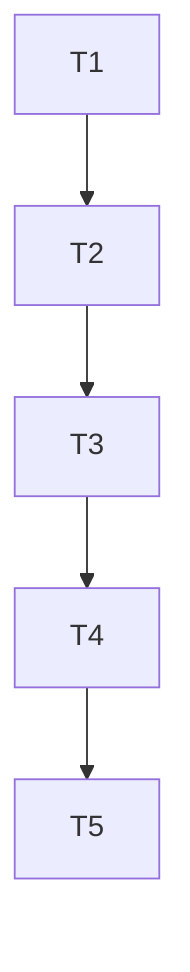

# S3-TASK (原子化阶段)

## 1. 子任务拆分

### T1: 创建目录结构
* **输入**: 映射设计。
* **输出**: `src/testframes` 下的子目录。
* **验收标准**: 目录存在。

### T2: 移动测试文件夹
* **输入**: `mv` 命令。
* **输出**: 文件夹移动到新位置。
* **验收标准**: `src/testframes` 下不再有零散的测试文件夹。

### T3: 创建类别级 CMakeLists.txt
* **输入**: 映射设计。
* **输出**: 每个子目录下的 `CMakeLists.txt`。
* **验收标准**: 文件内容包含对应的 `add_subdirectory`。

### T4: 更新根级 CMakeLists.txt
* **输入**: 新的目录结构。
* **输出**: 修改后的 `src/testframes/CMakeLists.txt`。
* **验收标准**: 根级文件整洁，按类别加载。

### T5: 验证构建
* **输入**: `cmake` 和 `make`。
* **输出**: 编译通过。
* **验收标准**: 测试目标成功生成。

## 2. 任务依赖图

