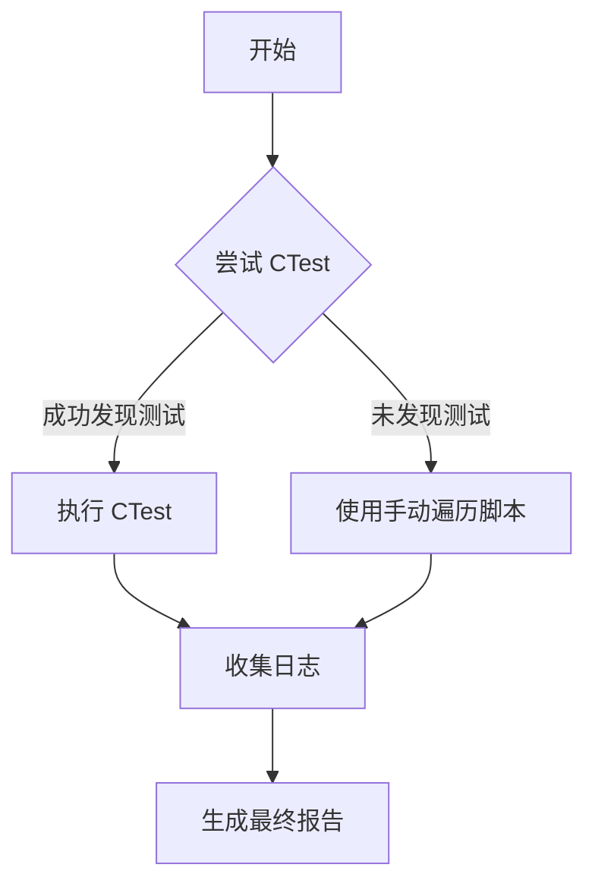

# S2-DESIGN (架构阶段)

## 1. 测试运行策略设计
我们将采用“双保险”策略来确保所有测试都能被运行。



## 2. 核心逻辑
### 2.1 CTest 运行
命令: `ctest --output-on-failure -j8`
优势: 能够并行运行，且与 CMake 集成度高。

### 2.2 手动遍历脚本 (后备)
命令: 
```bash
for t in out/Release/tests/test_*; do
    if [ -x "$t" ]; then
        echo "Running $t"
        "$t"
    fi
done
```
优势: 即使 CMake 目标注册有问题，也能直接执行编译出的二进制文件。

## 3. 结果汇总格式
* **Total**: 总数
* **Passed**: 通过数
* **Failed**: 失败数
* **List of Failures**: 失败项清单（如有）
