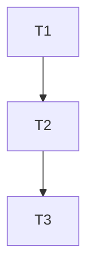

# S3-TASK (原子化阶段)

## 1. 子任务拆分

### T1: 执行测试
* **输入**: 编译好的项目。
* **输出**: 测试运行原始日志。
* **验收标准**: 所有可执行测试均运行完毕。

### T2: 解析与统计结果
* **输入**: 原始日志。
* **输出**: 统计数字（通过、失败、总数）。
* **验收标准**: 数字准确。

### T3: 编写总结文档
* **输入**: 统计结果。
* **输出**: `S6-ACCEPTANCE.md` 等。
* **验收标准**: 包含详细的通过率报告。

## 2. 任务依赖图

