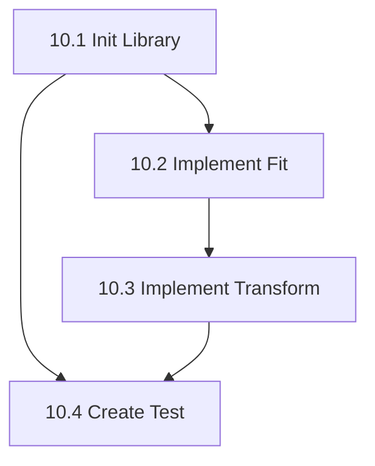

# Phase 10: Decoding Foundation (CSP) - S3 Task

## 任务拆分

### Task 10.1: 初始化 Decoding 库
*   **目标**: 创建库目录结构，配置构建系统。
*   **输入**: 无。
*   **输出**: `src/libraries/decoding` 目录，`CMakeLists.txt`，`decoding_global.h`。
*   **验证**: 能够编译通过，生成 `mne_decoding` 库（静态或动态）。

### Task 10.2: 实现 CSP::fit
*   **目标**: 实现 CSP 算法的核心训练逻辑。
*   **输入**: Epochs 数据。
*   **输出**: 计算出的 `m_matFilters`。
*   **实现**:
    *   协方差计算。
    *   Eigen 广义特征值分解。
    *   滤波器排序与选择。

### Task 10.3: 实现 CSP::transform
*   **目标**: 实现特征提取逻辑。
*   **输入**: Epochs 数据。
*   **输出**: 特征矩阵。
*   **实现**:
    *   $W^T X$ 投影。
    *   行方差计算。
    *   对数变换。

### Task 10.4: 创建验证测试
*   **目标**: 验证 CSP 实现的正确性。
*   **输入**: 模拟的二分类 EEG 数据（如两类不同频带能量的数据）。
*   **输出**: `test_decoding` 可执行文件。
*   **验证**:
    *   验证 `fit` 运行无崩溃。
    *   验证提取的特征在两类间有显著差异。
    *   (可选) 对比 Python 生成的基准数据。

## 任务依赖图

## 执行计划
1.  执行 Task 10.1
2.  执行 Task 10.2 & 10.3 (合并执行)
3.  执行 Task 10.4
