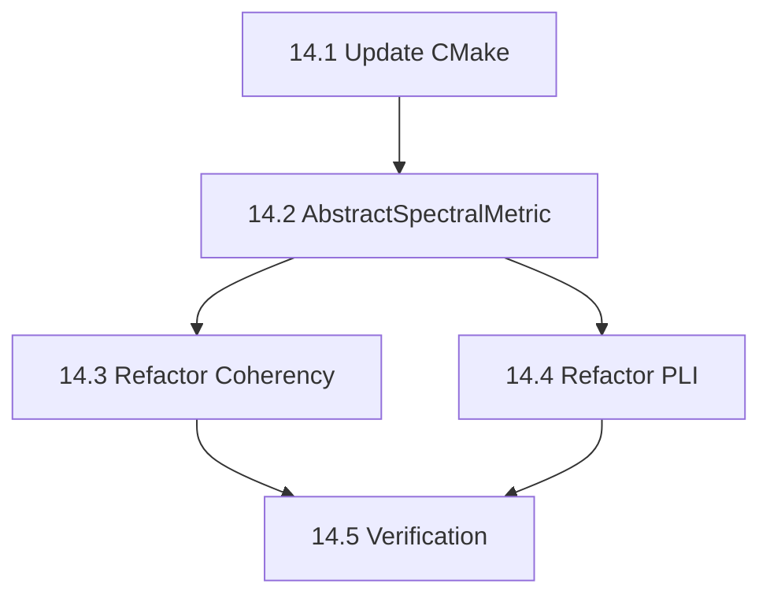

# Phase 14: Connectivity (Spectral Connectivity) - S3 Task

## 任务拆分

### Task 14.1: 更新构建配置
*   修改 `src/libraries/connectivity/CMakeLists.txt`，添加 `mne_tfr` 依赖。

### Task 14.2: 实现 AbstractSpectralMetric
*   创建 `metrics/abstractspectralmetric.h` 和 `.cpp`。
*   实现 `computeTaperedSpectra` 和 `generateTapers` (调用 `mne_tfr`)。

### Task 14.3: 重构 Coherency
*   修改 `metrics/coherency.h/cpp` 继承自 `AbstractSpectralMetric`。
*   使用新的 helper 函数替换手动 FFT/Taper 代码。
*   *Note*: `Coherence` uses `Coherency::calculateAbs`. `ImagCoherence` uses `Coherency::calculateImag`. So refactoring `Coherency` covers both.

### Task 14.4: 重构 PhaseLagIndex
*   修改 `metrics/phaselagindex.h/cpp` 继承自 `AbstractSpectralMetric`。
*   使用 new helper functions。

### Task 14.5: 验证测试
*   创建 `src/testframes/test_connectivity`。
*   测试 Coherence 和 PLI 的基本功能。

## 任务依赖图

