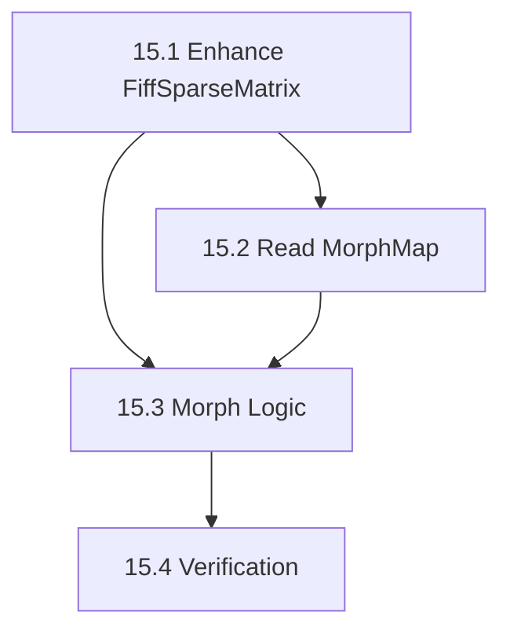

# Phase 15: Source Estimate Morphing - S3 Task

## 任务拆分

### Task 15.1: 增强 FiffSparseMatrix
*   修改 `src/libraries/fiff/c/fiff_sparse_matrix.h/cpp`。
*   添加 `toEigenSparse()` 方法，将内部 CRS/CCS 数据转换为 `Eigen::SparseMatrix<double>`。

### Task 15.2: 实现 MneMorphMap 读取
*   修改 `src/libraries/mne/c/mne_morph_map.h/cpp`。
*   实现 `readMorphMap` 静态方法，解析 `.fif` 文件中的 `MNE_MORPH_MAP`。
*   支持自动查找文件路径（类似 MNE-Python）。

### Task 15.3: 实现 Morphing 逻辑
*   在 `MneMorphMap` 中实现 `morphSourceEstimate`。
*   包含 STC 分割 (Split)、稀疏矩阵乘法、结果合并 (Merge)。

### Task 15.4: 验证测试
*   创建 `src/testframes/test_morphing`。
*   构造模拟的 Morph Matrix (即简单的单位阵或置换阵)。
*   验证 Morphing 后的数据是否正确。

## 任务依赖图

